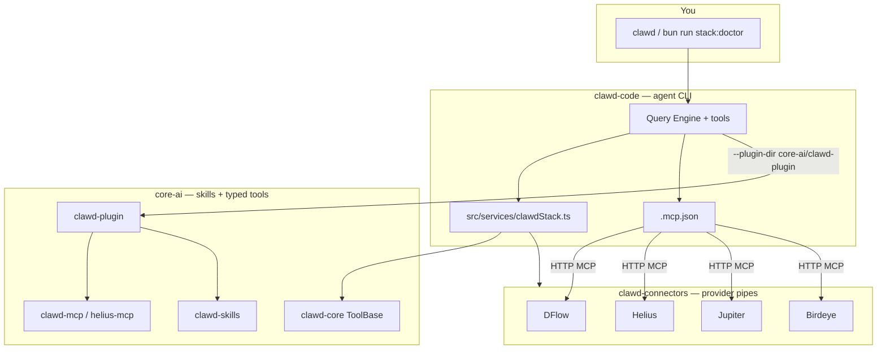

<div align="center">


[](https://github.com/Solizardking/clawd-core-ai)

**Solana-native AI agent stack** — the CLI, the provider pipes, and the Helius-wrapped brain in one checkout.

[](https://www.npmjs.com/package/@onchainai/clawd-code)
[](https://www.npmjs.com/package/@onchainai/clawd-core)
[](https://bun.sh)
[](https://solana.com)
[](https://modelcontextprotocol.io)

[](https://phantom.com/tokens/solana/8cHzQHUS2s2h8TzCmfqPKYiM4dSt4roa3n7MyRLApump)
[](https://dexscreener.com/solana/8cHzQHUS2s2h8TzCmfqPKYiM4dSt4roa3n7MyRLApump)
[](https://birdeye.so/token/8cHzQHUS2s2h8TzCmfqPKYiM4dSt4roa3n7MyRLApump)
[](https://jup.ag/swap/SOL-8cHzQHUS2s2h8TzCmfqPKYiM4dSt4roa3n7MyRLApump)

> `$CLAWD` · `8cHzQHUS2s2h8TzCmfqPKYiM4dSt4roa3n7MyRLApump`

</div>

---

## How the stack talks

Three packages. One protocol. Clawd Code is the agent, Connectors are the provider pipes, Core AI is the skill + MCP brain.



| Layer | Path | Speaks via | Job |
| --- | --- | --- | --- |
| **Clawd Code** | [`clawd-code/`](clawd-code/) | CLI, `.mcp.json`, `clawdStack.ts` | Agent loop — code, trade, research, image, voice |
| **Clawd Connectors** | [`clawd-connectors/`](clawd-connectors/) | Remote MCP + REST fallback | DFlow, Helius, Jupiter, Birdeye |
| **Clawd Core AI** | [`core-ai/`](core-ai/) | `--plugin-dir` + `helius-mcp` | Skills, plugin, typed tools, Helius MCP |

Run this from the repo root to prove the three layers can see each other:

```bash
bun install
cp .env.example .env.local   # fill HELIUS_API_KEY (and friends)
bun run stack:doctor
clawd --plugin-dir core-ai/clawd-plugin
```

Inside the CLI: `clawd stack` (or `/stack`).

---

## Quickstart

```bash
git clone https://github.com/Solizardking/clawd-core-ai.git
cd clawd-core-ai   # this repo: clawd-cloud

bun install
bun run stack:doctor

# agent + Core AI plugin (skills + auto-started MCP)
clawd --plugin-dir core-ai/clawd-plugin

# provider pipes only
bun run --cwd clawd-connectors doctor
```

Or install the published CLI:

```bash
npm install -g @onchainai/clawd-code
clawd-code code "build a Jupiter swap bot with slippage protection"
```

Trading defaults to **PAPER**. Live execution needs `LIVE_TRADING=true` and explicit confirmation.

---

## The three layers

<table>
<tr>
<td width="33%" align="center">

### 🦞 Clawd Code

Terminal-native agent<br/>React + Ink on Bun

[`clawd-code/`](clawd-code/) · [`@onchainai/clawd-code`](https://www.npmjs.com/package/@onchainai/clawd-code)

💻 CODE · 📈 TRADE · 🔬 RESEARCH<br/>🎨 IMAGE · 🎙️ VOICE

</td>
<td width="33%" align="center">

### 🔌 Connectors

MCP clients + REST fallback

[`clawd-connectors/`](clawd-connectors/) · `@openclawd/clawd-connectors`

DFlow · Helius · Jupiter · Birdeye

</td>
<td width="33%" align="center">

### 🧠 Core AI

Helius-wrapped brain

[`core-ai/`](core-ai/) · [`@onchainai/clawd-core`](https://www.npmjs.com/package/@onchainai/clawd-core)

plugin · skills · clawd-mcp · perps

</td>
</tr>
</table>

### Clawd Code

Solana-native coding agent. `src/` merges the Claude Code leaked archive with Clawd-native agents (perps, arena, x402, wallet).

```bash
clawd-code code "build a Jupiter swap bot with slippage protection"
clawd-code trade "what's the funding rate on SOL perps?"
clawd-code research "compare AutoGPT, LangChain, CrewAI, AutoGen"
clawd-code arena status
```

### Clawd Connectors

Remote MCP + typed REST for the four providers the agent actually calls on-chain:

```ts
import { createConnectors } from "@openclawd/clawd-connectors";

const connectors = createConnectors();
await connectors.dflow.callTool("open_position", { size: 10 });
await connectors.helius.rpc("getBalance", ["somePubkey"]);
```

Shared registry: [`.mcp.json`](.mcp.json) (repo root, `clawd-code/`, and `core-ai/clawd-plugin/`).

### Clawd Core AI

This is the layer people miss. [`core-ai/`](core-ai/) is not a docs folder — it is the Helius-wrapped runtime Clawd Code loads:

| Package | What Clawd Code gets |
| --- | --- |
| [`core-ai/clawd-plugin`](core-ai/clawd-plugin) | Skills + auto-start MCP (`clawd --plugin-dir core-ai/clawd-plugin`) |
| [`core-ai/clawd-core`](core-ai/clawd-core) | `ToolBase` / `PluginBase` / `WalletClientBase` — `@onchainai/clawd-core` |
| [`core-ai/clawd-mcp`](core-ai/clawd-mcp) | 10 routed Helius tools (`npx helius-mcp@latest`) |
| [`core-ai/clawd-skills`](core-ai/clawd-skills) | Canonical Solana / Pump / DFlow / Imperial / Vulcan skills |
| [`core-ai/clawd-agents`](core-ai/clawd-agents) | Perps + Grok agent runtimes |
| [`core-ai/constitution`](core-ai/constitution) | Laws, `SOUL.md`, `IDENTITY.md` |

Full Core AI map: [`core-ai/README.md`](core-ai/README.md).

---

## Directory layout

```
clawd-cloud/
├── clawd-code/                 # Agent CLI  →  @onchainai/clawd-code
│   ├── src/                    # Query engine, tools, commands, Ink UI
│   ├── src/services/clawdStack.ts   # Bridge to connectors + core-ai
│   ├── .mcp.json               # Same provider MCP registry
│   ├── .claude-plugin/         # Marketplace → ../core-ai/clawd-plugin
│   ├── mcp-server/             # Source explorer MCP (Vercel)
│   └── clawdrouter/            # Multi-model LLM router
│
├── clawd-connectors/           # Provider pipes  →  @openclawd/clawd-connectors
│   ├── src/providers/          # DFlow, Helius, Jupiter, Birdeye
│   └── .mcp.json               # Remote MCP URLs
│
├── core-ai/                    # Helius-wrapped brain
│   ├── clawd-plugin/           # Skills + auto-started MCP servers
│   ├── clawd-core/             # Typed-tool foundation
│   ├── clawd-mcp/              # helius-mcp
│   ├── clawd-skills/           # Canonical skill source
│   ├── clawd-agents/           # Perps + Grok runtimes
│   └── constitution/           # Governance bundle
│
├── docs/                       # Architecture guides
├── .mcp.json                   # Root MCP registry (cwd auto-load)
├── .claude-plugin/             # Root marketplace → ./core-ai/clawd-plugin
└── scripts/stack-doctor.ts     # bun run stack:doctor
```

---

## MCP servers (what actually loads)

When you run Clawd from this repo, [`.mcp.json`](.mcp.json) + the plugin register:

| Server | Transport | Source |
| --- | --- | --- |
| DFlow | HTTP | Connectors |
| Helius | HTTP | Connectors |
| Jupiter | HTTP | Connectors |
| Birdeye | HTTP | Connectors |
| ZK Compression | HTTP | Core AI plugin |
| clawd-mcp | `npx helius-mcp@latest` | Core AI |
| clawd-code-explorer | local node | `clawd-code/mcp-server` |

Keys (see [`.env.example`](.env.example)):

| Variable | Layer |
| --- | --- |
| `ANTHROPIC_API_KEY` / `XAI_API_KEY` / `MOONSHOT_API_KEY` / `DEEPSEEK_API_KEY` / `OPENROUTER_API_KEY` | Clawd Code models |
| `HELIUS_API_KEY` / `SOLANA_RPC_URL` | Core AI + Connectors |
| `DFLOW_API_KEY` / `JUPITER_API_KEY` / `BIRDEYE_API_KEY` | Connectors |

---

## Docs

| Guide | Description |
| --- | --- |
| [Architecture](docs/architecture.md) | Core pipeline, startup, state, rendering |
| [Tools](docs/tools.md) | Agent tool catalog + permission model |
| [Commands](docs/commands.md) | Slash commands by category |
| [Subsystems](docs/subsystems.md) | Bridge, MCP, plugins, skills |
| [Exploration](docs/exploration-guide.md) | How to navigate the leaked source |
| [Open Clawd ADR](docs/ADR-001-open-clawd-v2.md) | v2 direction |

Also: [`agent.md`](agent.md) · [`Skill.md`](Skill.md) · [`clawd-code/CLAWD.md`](clawd-code/CLAWD.md) · [`core-ai/README.md`](core-ai/README.md) · [`clawd-connectors/README.md`](clawd-connectors/README.md)

---

## Development

```bash
bun install
bun run stack:doctor       # layers + MCP + connector probe
bun run build              # bundle Clawd Code
bun run typecheck
bun run connectors:test
bun run core:skills        # compile core-ai skills
```

Workspaces: `clawd-code`, `clawd-connectors`, `core-ai/clawd-core`, `core-ai/clawd-plugin`, `core-ai/clawd-mcp`.

---

## Disclaimer

`clawd-code/src/` preserves source leaked from Anthropic's npm registry on **2026-03-31**. Original source is the property of [Anthropic](https://www.anthropic.com). Not an official release. Clawd Code, Clawd Connectors, and Clawd Core AI are independent Clawd-native layers built on top.

---

<div align="center">

[Clawd Code](clawd-code/) · [Connectors](clawd-connectors/) · [Core AI](core-ai/) · [$CLAWD](https://phantom.com/tokens/solana/8cHzQHUS2s2h8TzCmfqPKYiM4dSt4roa3n7MyRLApump) · [Helius](https://www.helius.dev) · [MCP](https://modelcontextprotocol.io)


<sub>🦞 Clawd Cloud</sub>

</div>
