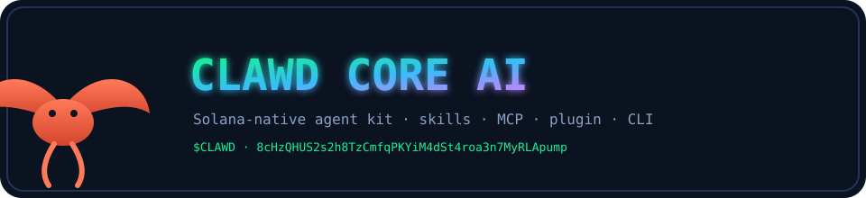

# Clawd Core AI

<p align="center">
  
</p>

```text
          \   /                      \   /
       .---o o---.                .---o o---.
      /   CLAWD   \==============/   CORE    \
      \    🦞     /              \    AI     /
       '---------'                '---------'
            |                          |
            +-------- this checkout ---+
```

This directory **is** the Clawd Core AI checkout — a lobster-native Solana agent kit. It is not a leftover Helius-only tree, not Claude Code Explorer, and not a pointer into a parent monorepo. Helius is the RPC/MCP infrastructure this stack wraps. The identity is Clawd.

[](https://phantom.com/tokens/solana/8cHzQHUS2s2h8TzCmfqPKYiM4dSt4roa3n7MyRLApump)
[](https://dexscreener.com/solana/8cHzQHUS2s2h8TzCmfqPKYiM4dSt4roa3n7MyRLApump)
[](https://birdeye.so/token/8cHzQHUS2s2h8TzCmfqPKYiM4dSt4roa3n7MyRLApump)
[](https://jup.ag/swap/SOL-8cHzQHUS2s2h8TzCmfqPKYiM4dSt4roa3n7MyRLApump)
[](https://www.npmjs.com/package/@onchainai/clawd-code)
[](https://www.npmjs.com/package/helius-mcp)

```text
Token:  $CLAWD · 8cHzQHUS2s2h8TzCmfqPKYiM4dSt4roa3n7MyRLApump
Model:  ordlibrary/DeepSolanaZKr-1 · solanaclawd/solana-clawd-1.5b-lora
Root:   @onchainai/core-ai  (private — not published)
```

There is **no** `helius-cli/`, `helius-cursor/`, or `character/` directory in this checkout. `zk-primitives/` exists and is empty. `clawd-agents/` is **not** empty.

## Install this checkout

```bash
# plugin + skills (no compile)
node clawd-plugin/cli.js doctor
node clawd-skills/cli.js doctor
clawd --plugin-dir ./clawd-plugin

# v3 CLI (source bin, no compile)
node v3/src/index.mjs --help

# MCP from this tree after build
cd clawd-mcp && pnpm install && pnpm build && node dist/index.js --help
# published unscoped install path still used by ./.mcp.json:
#   npx -y helius-mcp@latest
# scoped name that this package.json actually ships:
#   npx -y @onchainai/clawd-mcp   # bin remains helius-mcp

# full smoke of launchable packages
bash scripts/smoke.sh
```

`.mcp.json` still launches `npx -y helius-mcp@latest`. The package in [`clawd-mcp/package.json`](./clawd-mcp/package.json) is **`@onchainai/clawd-mcp@1.3.0`** with bin **`helius-mcp`**. The unscoped `helius-mcp@2.1.0` still exists on npm (and a leftover copy lives under `clawd-code/clawd-mcp`). GitHub Actions in [`.github/workflows/mcp-publish.yml`](./.github/workflows/mcp-publish.yml) still publishes on tags named `helius-mcp@*`.

Marketplace JSON sources `./core-ai/clawd-plugin` and `./helius-plugin` in [`.claude-plugin/marketplace.json`](./.claude-plugin/marketplace.json) / [`.clawd-plugin/marketplace.json`](./.clawd-plugin/marketplace.json) do **not** match this checkout — use `./clawd-plugin`.

Root `npm run stack:doctor` points at `../scripts/stack-doctor.ts` (parent cloud repo). That file is **missing** when this directory is the workspace root.

## Tree

```mermaid
flowchart TB
  ROOT["clawd-core-ai<br/>@onchainai/core-ai private"]
  ROOT --> AGENTS[".agents/skills<br/>generated Clawd skills"]
  ROOT --> PLUGINM[".claude-plugin + .clawd-plugin<br/>marketplace leftovers"]
  ROOT --> GH[".github/workflows"]
  ROOT --> AG["clawd-agents"]
  AG --> RUST["agent/ Rust kit"]
  AG --> GROK["clawd-grok<br/>@onchainai/clawd-grok"]
  AG --> PERPS["clawd-perps-agent<br/>@solanaclawd/clawd-agents-perps private"]
  ROOT --> CODE["clawd-code<br/>@onchainai/clawd-code"]
  ROOT --> CONN["clawd-connectors<br/>@onchainai/clawd-connectors"]
  ROOT --> CORE["clawd-core<br/>@onchainai/clawd-core"]
  ROOT --> MCP["clawd-mcp<br/>@onchainai/clawd-mcp<br/>bin helius-mcp"]
  ROOT --> PLUG["clawd-plugin<br/>@onchainai/clawd-plugin"]
  ROOT --> ROUTER["clawd-router<br/>@onchainai/clawdrouter"]
  ROOT --> SKILLS["clawd-skills<br/>@onchainai/clawd-skills canonical"]
  ROOT --> TUI["clawd-tui<br/>@onchainai/clawd-tui"]
  ROOT --> WALLET["clawd-wallet/src only<br/>no package.json"]
  ROOT --> CONST["constitution"]
  ROOT --> DOCS["docs"]
  ROOT --> KNOW["knowledge"]
  ROOT --> PUMP["mcp-server<br/>@onchainai/mcp-server bin pump-mcp"]
  ROOT --> OUT["outputs generated"]
  ROOT --> SCR["scripts/compile-skills.ts"]
  ROOT --> TAIL["tailclawd private"]
  ROOT --> V3["v3 @onchainai/v3"]
  ROOT --> ZK["zk-primitives empty"]
```



## Shipping packages

Public packages set `publishConfig.access: public`. Private packages are never published.

| Path | npm `name` | ver | bin / run | Install or run from this tree |
|---|---|---|---|---|
| [`clawd-mcp/`](./clawd-mcp) | `@onchainai/clawd-mcp` | 1.3.0 | `helius-mcp` | `cd clawd-mcp && pnpm install && pnpm build` then `node dist/index.js`. 10 public tools: 9 routed Helius domains + `expandResult`. |
| [`clawd-plugin/`](./clawd-plugin) | `@onchainai/clawd-plugin` | 1.0.0 | `clawd-plugin` | `clawd --plugin-dir ./clawd-plugin` or `node clawd-plugin/cli.js doctor` |
| [`clawd-core/`](./clawd-core) | `@onchainai/clawd-core` | 1.0.1 | library | `cd clawd-core && npm install && npm run typecheck` |
| [`clawd-skills/`](./clawd-skills) | `@onchainai/clawd-skills` | 1.0.0 | `clawd-skills` | `node clawd-skills/cli.js doctor` — canonical `SKILL.md` source |
| [`clawd-code/`](./clawd-code) | `@onchainai/clawd-code` | 1.0.0 | `clawd-code` | `bun clawd-code/src/cli.ts --help` or `cd clawd-code && npm install && npm run build` |
| [`clawd-connectors/`](./clawd-connectors) | `@onchainai/clawd-connectors` | 0.1.0 | `clawd-connectors` | `cd clawd-connectors && npm install && npm run doctor` |
| [`clawd-router/`](./clawd-router) | `@onchainai/clawdrouter` | 0.1.0 | `clawdrouter` | `cd clawd-router && npm install && npm run doctor` |
| [`clawd-tui/`](./clawd-tui) | `@onchainai/clawd-tui` | 0.1.0 | `clawd-tui` / `clawd` / `dark-clawd` | `cd clawd-tui && npm install && npm run typecheck` |
| [`mcp-server/`](./mcp-server) | `@onchainai/mcp-server` | 1.0.0 | `pump-mcp` | `cd mcp-server && npm install && npm run lint` — Pump SDK MCP (55 tools) |
| [`v3/`](./v3) | `@onchainai/v3` | 3.0.0 | `clawd` / `clawd3` / `occ` | `node v3/src/index.mjs --help` |
| [`clawd-agents/clawd-grok/`](./clawd-agents/clawd-grok) | `@onchainai/clawd-grok` | 1.0.0 | `clawd-grok` | `cd clawd-agents/clawd-grok && bun install && bun run src/index.ts --help` |
| [`clawd-agents/clawd-perps-agent/`](./clawd-agents/clawd-perps-agent) | `@solanaclawd/clawd-agents-perps` | 0.1.0 | `clawd-agents-perps` | **private** — `cd clawd-agents/clawd-perps-agent && npm install && npm run typecheck` |
| [`tailclawd/`](./tailclawd) | `tailclawd` | 0.2.0 | none | **private** — `cd tailclawd && npm install && npm test` |
| [`package.json`](./package.json) | `@onchainai/core-ai` | — | `plugin:doctor` / `compile-skills` | **private** workspace root |

Nested leftover copies (not the shipping path for this checkout):

- [`clawd-code/clawd-mcp`](./clawd-code/clawd-mcp) — `helius-mcp@2.1.0` (matches the still-published unscoped npm name)
- [`clawd-code/mcp-server`](./clawd-code/mcp-server) — leftover `warrioraashuu-codemaster@1.1.0`
- [`clawd-code/web`](./clawd-code/web) — private `claude-code-web`

## Directory map

| Path | Purpose |
|---|---|
| [`.agents/`](./.agents) | Generated Clawd-native skill discovery tree. `.agents/skills/` is compiled from `clawd-skills/` by `scripts/compile-skills.ts`. |
| [`.claude-plugin/`](./.claude-plugin) | Marketplace leftover (`marketplace.json` source `./core-ai/clawd-plugin` — wrong for this tree). |
| [`.clawd-plugin/`](./.clawd-plugin) | Marketplace leftover (`marketplace.json` source `./helius-plugin` — that dir does not exist here). |
| [`.github/`](./.github) | CI: `mcp-publish.yml` still tags `helius-mcp@*`, plus `mcp-release.yml`, `sync-check.yml`, `test.yml`, `verify-signed-commits.yml`. |
| [`clawd-agents/`](./clawd-agents) | **Filled.** Rust `agent/` (`openclawd-solana-kit`), Bun `clawd-grok`, private `clawd-perps-agent`. |
| [`clawd-code/`](./clawd-code) | Solana-native AI coding CLI (`@onchainai/clawd-code`) with modes code/trade/research/image/voice. |
| [`clawd-connectors/`](./clawd-connectors) | MCP connectors for DFlow, Helius, Jupiter, Birdeye (`@onchainai/clawd-connectors`). |
| [`clawd-core/`](./clawd-core) | Typed agent toolkit: `ToolBase` / `createTool()`, plugins, wallet clients (`@onchainai/clawd-core`). |
| [`clawd-mcp/`](./clawd-mcp) | Clawd-wrapped Helius MCP server (`@onchainai/clawd-mcp`, bin `helius-mcp`). |
| [`clawd-plugin/`](./clawd-plugin) | Clawd Code plugin: bundled skills + `.mcp.json` + `cli.js doctor`. |
| [`clawd-router/`](./clawd-router) | LLM router (`@onchainai/clawdrouter`) — wallet-signed, x402, OpenAI-compatible proxy. |
| [`clawd-skills/`](./clawd-skills) | Canonical skill source for vendored packs (Imperial, Vulcan, Pump, DFlow, Light, zkrouter, `svm`, …). **`helius*` source dirs are missing here**; generated copies live under `.agents/skills/`. |
| [`clawd-tui/`](./clawd-tui) | Lobster TUI (`@onchainai/clawd-tui`). |
| [`clawd-wallet/`](./clawd-wallet) | Source only (`src/cli.ts`, vault, keygen, server). **No `package.json`.** |
| [`constitution/`](./constitution) | Governance: `CONSTITUTION.md`, `SOUL.md`, `IDENTITY.md`, three/six laws, `program.md`, `strategy.md`. |
| [`docs/`](./docs) | Architecture notes + ADRs + this banner SVG. Not `docs/adr/`. |
| [`knowledge/`](./knowledge) | Facts, gotchas, patterns, anti-patterns, decisions, API behaviors. |
| [`mcp-server/`](./mcp-server) | Pump SDK MCP (`@onchainai/mcp-server`, bin `pump-mcp`). |
| [`outputs/`](./outputs) | **Generated** leftover `clawd-code-*.ts` snippets. Not a package. |
| [`scripts/`](./scripts) | `compile-skills.ts` (canonical → `.agents/skills` + `clawd-mcp/system-prompts`). `smoke.sh` + README map test. |
| [`tailclawd/`](./tailclawd) | Local UI + Tailscale session monitor. **Private.** |
| [`v3/`](./v3) | Unified Grok-first CLI (`@onchainai/v3`). |
| [`zk-primitives/`](./zk-primitives) | **Empty placeholder.** No `package.json`, not `@clawd/zk-primitives`. |

## Root files

| Path | Purpose |
|---|---|
| [`.env.example`](./.env.example) | Template for LLM, Helius, connector, and paper-trading env vars. |
| `.env.local` | Local secrets. **Gitignored.** Do not commit. |
| [`.gitignore`](./.gitignore) | Ignores `node_modules/`, `dist/`, `.env.local`, package runtime dirs. Still mentions removed `helius-cli` / `helius-mcp` lockfile exceptions. |
| [`.mcp.json`](./.mcp.json) | Workspace MCP: hosted DFlow/Helius/Jupiter/Birdeye/zkcompression plus `npx -y helius-mcp@latest`. |
| [`.npmrc`](./.npmrc) | `minimum-release-age=10080` (npm 11 warns this project config will go away). |
| [`agent.md`](./agent.md) | Repository-agent operating guide (still titled for claude-code). |
| [`AGENTS.md`](./AGENTS.md) | Layer A harness. Paths inside it still name `helius-mcp/` / `helius-plugin/` / `helius-cli/` — those dirs are gone; use this README. |
| [`biome.json`](./biome.json) | Biome lint/format for JS/TS. |
| [`bun.lock`](./bun.lock) | Bun lockfile for this workspace. |
| [`bunfig.toml`](./bunfig.toml) | Preloads `clawd-code/scripts/bun-plugin-shims.ts`. |
| [`CLAUDE.md`](./CLAUDE.md) | Compatibility shim that still says `./helius-plugin` and `helius-skills/`. Prefer `AGENTS.md` + this file. |
| [`claw`](./claw) | Standalone HTML/CSS **ClawdRouter web UI** (not a binary). |
| [`CLAWD.md`](./CLAWD.md) | Clawd harness. Some links (`./clawd-grok`, `./clawd-perps-agent`, `./helius-plugin`) are stale. |
| [`CONTRIBUTING.md`](./CONTRIBUTING.md) | Signed-commit rules. Package list still names removed `helius-*` dirs. |
| [`Dockerfile`](./Dockerfile) | **Leftover** Claude Code production image (`docker build -t claude-code .`). |
| [`gitpretty-apply.sh`](./gitpretty-apply.sh) | Applies gitpretty per-file commit beautification. |
| [`glama.json`](./glama.json) | Glama MCP maintainer list (Helius-era names). |
| [`LICENSE`](./LICENSE) | MIT, copyright 2026 Helius Labs. |
| [`package-lock.json`](./package-lock.json) | Empty npm lock (`name: core-ai`, no packages). |
| [`package.json`](./package.json) | Private `@onchainai/core-ai`. Scripts: `compile-skills`, `plugin:doctor`, `stack:doctor` (parent missing), `test`, `smoke`. |
| [`README.md`](./README.md) | This map. |
| [`SECURITY.md`](./SECURITY.md) | Paper-trading default; secret + vuln reporting. |
| [`server.json`](./server.json) | **Leftover** MCP registry entry for `warrioraashuu-codemaster` / Claude Code Explorer. |
| [`Skill.md`](./Skill.md) | **Leftover** Claude Code repository skill (not a Clawd skill pack). |
| [`tsconfig.json`](./tsconfig.json) | Root TS config. `paths` still mention `core-ai/clawd-core` (wrong relative to this root). |
| [`vercel.json`](./vercel.json) | Vercel routes for leftover `clawd-code/mcp-server/api`. |
| [`versions.json`](./versions.json) | Skill version stamps (`helius`, `helius-dflow`, …) read by `compile-skills.ts`. |

## Leftovers and generated output

Labeled so they are not treated as shipping products:

- **Generated:** `.agents/skills/`, `clawd-mcp/system-prompts/` — from `clawd-skills/` via `npx tsx scripts/compile-skills.ts`. `clawd-plugin/skills/` is a slim compiled subset (`build`, `dflow`, `jupiter`, `okx`, `phantom`, `svm`). A `clawd-cursor/skills/` sync target is referenced in the compiler and is a no-op (no `clawd-cursor/` package).
- **Generated leftovers:** `outputs/clawd-code-*.ts`.
- **Empty:** `zk-primitives/`.
- **Source-only:** `clawd-wallet/` (no package manifest).
- **Leftover identity:** `Dockerfile`, `Skill.md`, `server.json`, `clawd-code/mcp-server` (`warrioraashuu-codemaster`), marketplace JSON sources, `AGENTS.md` / `CLAWD.md` / `CLAUDE.md` / `CONTRIBUTING.md` Helius path names.
- **Still-published unscoped name:** `helius-mcp@2.1.0` on npm. This tree's MCP package is `@onchainai/clawd-mcp@1.3.0`.
- **Not present:** `helius-cli`, `helius-cursor`, `helius-skills`, `helius-plugin`, `character/`, `clawd-grok/` at repo root, `clawdrouter/` at repo root.

## clawd-mcp tools

The server exposes 10 public tools:

- `heliusAccount` · `heliusWallet` · `heliusAsset` · `heliusTransaction` · `heliusChain`
- `heliusStreaming` · `heliusKnowledge` · `heliusWrite` · `heliusCompression`
- `expandResult`

Routed tools take a Helius action in `action` (for example `heliusWallet` + `getBalance`). Heavy responses are summary-first; `expandResult` fetches a section, range, page, or continuation.

MCP-only setup (matches [`.mcp.json`](./.mcp.json)):

```json
{
  "mcpServers": {
    "clawd-mcp": {
      "command": "npx",
      "args": ["-y", "helius-mcp@latest"],
      "env": {
        "HELIUS_API_KEY": "${HELIUS_API_KEY}",
        "SOLANA_RPC_URL": "${SOLANA_RPC_URL}"
      }
    },
    "zkcompression": {
      "type": "http",
      "url": "https://www.zkcompression.com/mcp"
    }
  }
}
```

After `@onchainai/clawd-mcp` is on the registry, prefer `npx -y @onchainai/clawd-mcp` (bin is still `helius-mcp`).

## Skills

Canonical source for most packs is [`clawd-skills/`](./clawd-skills). Discovery copy is [`.agents/skills/`](./.agents/skills). `scripts/compile-skills.ts` still expects `clawd-skills/helius*` — **those source dirs are missing in this checkout**; the generated copies remain under `.agents/skills/` and the plugin subset under `clawd-plugin/skills/` (`build`, `dflow`, `jupiter`, `okx`, `phantom`, `svm`). `clawd-skills/svm` does exist.

| Skill | On-disk path | Invoke | Description |
|---|---|---|---|
| [`helius`](./.agents/skills/helius) | `.agents/skills/helius` (generated; no `clawd-skills/helius`) | `/clawd:build` | Solana apps on Helius infrastructure |
| [`helius-dflow`](./.agents/skills/helius-dflow) | `.agents/skills/helius-dflow` | `/clawd:dflow` | DFlow + Helius trading |
| [`helius-jupiter`](./.agents/skills/helius-jupiter) | `.agents/skills/helius-jupiter` | `/clawd:jupiter` | Jupiter + Helius DeFi |
| [`helius-phantom`](./.agents/skills/helius-phantom) | `.agents/skills/helius-phantom` | `/clawd:phantom` | Phantom + Helius frontends |
| [`helius-okx`](./.agents/skills/helius-okx) | `.agents/skills/helius-okx` | `/clawd:okx` | OKX + Helius intelligence |
| [`svm`](./clawd-skills/svm) | `clawd-skills/svm` + `.agents/skills/svm` | `/clawd:svm` | Solana protocol internals |

Vendored packs in the same tree include Cheshire Terminal, Imperial, Vulcan, Pump, DFlow, Light compressed accounts, zkrouter, MagicBlock, and others. For upstream Light Protocol extras:

```bash
npx skills add Lightprotocol/skills
```

## Smoke

```bash
npm test          # scripts/readme-map.test.mjs — README vs on-disk paths + package names
bash scripts/smoke.sh
```

`scripts/smoke.sh` drives each launchable from its real entry (`doctor`, `--help`, `typecheck`, or existing `test`). Missing parent `stack:doctor` and missing `node_modules` are recorded as **skips**, not passes.

Requirements for full package builds: Node.js 20+, pnpm or npm or bun, and a Helius key from https://dashboard.helius.dev for live chain calls (not required for `--help` / `doctor`).

## Resources

- [Clawd Code](./clawd-code)
- [Clawd Connectors](./clawd-connectors)
- [Clawd Plugin](./clawd-plugin)
- [Helius](https://www.helius.dev/)
- [Helius Docs](https://www.helius.dev/docs)
- [Model Context Protocol](https://modelcontextprotocol.io)
- [ZK Compression](https://www.zkcompression.com/)
