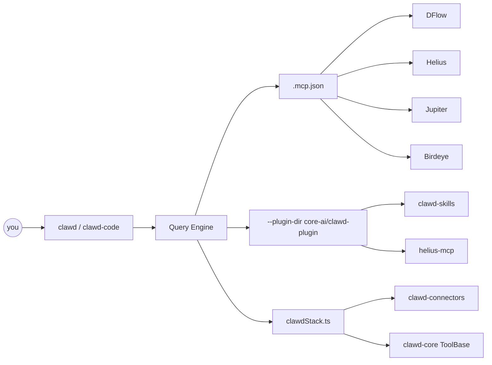

<div align="center">


[](https://github.com/Solizardking/clawd-core-ai)

**A lobster-native agent that writes code, talks to live Solana APIs, and loads Helius skills from one checkout.**

<br />

[](https://github.com/Solizardking/clawd-core-ai/stargazers)
[](https://github.com/Solizardking/clawd-core-ai/network/members)
[](https://github.com/Solizardking/clawd-core-ai/commits)
[](https://github.com/Solizardking/clawd-core-ai/issues)

[](https://www.npmjs.com/package/@onchainai/clawd-code)
[](https://www.npmjs.com/package/@onchainai/clawd-core)
[](#license)
[](https://bun.sh)
[](https://solana.com)
[](https://modelcontextprotocol.io)

[](https://phantom.com/tokens/solana/8cHzQHUS2s2h8TzCmfqPKYiM4dSt4roa3n7MyRLApump)
[](https://dexscreener.com/solana/8cHzQHUS2s2h8TzCmfqPKYiM4dSt4roa3n7MyRLApump)
[](https://birdeye.so/token/8cHzQHUS2s2h8TzCmfqPKYiM4dSt4roa3n7MyRLApump)
[](https://jup.ag/swap/SOL-8cHzQHUS2s2h8TzCmfqPKYiM4dSt4roa3n7MyRLApump)

`8cHzQHUS2s2h8TzCmfqPKYiM4dSt4roa3n7MyRLApump`

<br />


</div>

---

## 60-second start

```bash
git clone https://github.com/Solizardking/clawd-core-ai.git
cd clawd-core-ai
bun install
cp .env.example .env.local          # add HELIUS_API_KEY (and any LLM keys)
bun run stack:doctor                # prove the three layers can see each other
clawd --plugin-dir core-ai/clawd-plugin
```

Or skip the checkout and install the CLI:

```bash
npm install -g @onchainai/clawd-code
clawd-code code "build a Jupiter swap bot with slippage protection"
```

> **Trading is PAPER by default.** Live orders require `LIVE_TRADING=true` and explicit confirmation. Never commit `.env` / `.env.local`.

<p align="center">
  
</p>

---

## What you just cloned

Three packages that already speak MCP to each other:

<table>
<tr>
<td width="33%" align="center">

### 🦞 Clawd Code

Agent CLI · React + Ink · Bun

[`clawd-code/`](clawd-code/)
[`@onchainai/clawd-code`](https://www.npmjs.com/package/@onchainai/clawd-code)

💻 CODE · 📈 TRADE · 🔬 RESEARCH
🎨 IMAGE · 🎙️ VOICE

</td>
<td width="33%" align="center">

### 🔌 Connectors

Remote MCP + REST fallback

[`clawd-connectors/`](clawd-connectors/)
`@openclawd/clawd-connectors`

DFlow · Helius · Jupiter · Birdeye

</td>
<td width="33%" align="center">

### 🧠 Core AI

Skills, plugin, typed tools

[`core-ai/`](core-ai/)
[`@onchainai/clawd-core`](https://www.npmjs.com/package/@onchainai/clawd-core)

plugin · clawd-mcp · constitution

</td>
</tr>
</table>



| Layer | Speaks via | Job |
| --- | --- | --- |
| **Clawd Code** | CLI, `.mcp.json`, [`clawdStack.ts`](clawd-code/src/services/clawdStack.ts) | Agent loop |
| **Connectors** | HTTP MCP + REST | Live DFlow / Helius / Jupiter / Birdeye |
| **Core AI** | `--plugin-dir core-ai/clawd-plugin` | Skills + Helius MCP + `ToolBase` |

Inside the CLI: `clawd stack` or `/stack`.

---

## Modes

```bash
clawd-code code "build a Jupiter swap bot with slippage protection"
clawd-code trade "what's the funding rate on SOL perps?"
clawd-code research "compare AutoGPT, LangChain, CrewAI, AutoGen"
clawd-code image "cyberpunk Solana trading desk"
clawd-code voice "the task is complete"
clawd-code arena status
```

<table>
<tr>
<td align="center" width="20%">💻<br/><b>CODE</b><br/><sub>stream, review, ship</sub></td>
<td align="center" width="20%">📈<br/><b>TRADE</b><br/><sub>Phoenix + Vulcan · paper first</sub></td>
<td align="center" width="20%">🔬<br/><b>RESEARCH</b><br/><sub>long-context synthesis</sub></td>
<td align="center" width="20%">🎨<br/><b>IMAGE</b><br/><sub>x402-paid gen</sub></td>
<td align="center" width="20%">🎙️<br/><b>VOICE</b><br/><sub>TTS + STT</sub></td>
</tr>
</table>

---

## Connectors

```ts
import { createConnectors } from "@openclawd/clawd-connectors";

const connectors = createConnectors();
await connectors.helius.rpc("getBalance", ["YourPubkeyHere"]);
await connectors.dflow.callTool("open_position", { size: 10 });
```

```bash
bun run --cwd clawd-connectors doctor
```

Shared registry: [`.mcp.json`](.mcp.json) (repo root, `clawd-code/`, and `core-ai/clawd-plugin/`).

| Server | How it loads |
| --- | --- |
| DFlow / Helius / Jupiter / Birdeye | HTTP MCP from Connectors |
| ZK Compression | HTTP MCP from the Core AI plugin |
| clawd-mcp | `npx helius-mcp@latest` |
| clawd-code-explorer | `clawd-code/mcp-server` |

Keys live in [`.env.example`](.env.example) — copy to `.env.local`.

---

## Core AI

[`core-ai/`](core-ai/) is the runtime Clawd Code loads, not a docs dump.

| Package | What you get |
| --- | --- |
| [`clawd-plugin`](core-ai/clawd-plugin) | Skills + auto-started MCP |
| [`clawd-core`](core-ai/clawd-core) | `ToolBase` / `PluginBase` / `WalletClientBase` |
| [`clawd-mcp`](core-ai/clawd-mcp) | 10 routed Helius tools |
| [`clawd-skills`](core-ai/clawd-skills) | Solana / Pump / DFlow / Imperial / Vulcan |
| [`clawd-agents`](core-ai/clawd-agents) | Perps + Grok runtimes |
| [`constitution`](core-ai/constitution) | Laws, `SOUL.md`, `IDENTITY.md` |

---

## Repo map

```
clawd-cloud/
├── clawd-code/              @onchainai/clawd-code
│   ├── src/                 query engine, tools, Ink UI
│   ├── src/services/clawdStack.ts
│   ├── .mcp.json
│   └── mcp-server/          source explorer (Vercel)
├── clawd-connectors/        @openclawd/clawd-connectors
├── core-ai/                 plugin · skills · clawd-core · clawd-mcp
├── docs/                    architecture guides
├── .mcp.json                root MCP registry
├── .claude-plugin/          marketplace → ./core-ai/clawd-plugin
└── scripts/stack-doctor.ts  bun run stack:doctor
```

---

## Develop

```bash
bun install
bun run stack:doctor
bun run build
bun run typecheck
bun run connectors:test
bun run core:skills
```

Workspaces: `clawd-code`, `clawd-connectors`, `core-ai/clawd-core`, `core-ai/clawd-plugin`.

Docs: [architecture](docs/architecture.md) · [tools](docs/tools.md) · [commands](docs/commands.md) · [subsystems](docs/subsystems.md) · [ADR](docs/ADR-001-open-clawd-v2.md)

---

## Contributing

PRs welcome on docs, the MCP explorer, connectors, Core AI skills, and stack wiring.

1. Fork → branch off `main`.
2. Keep diffs small. Match nearby TypeScript style.
3. `bun run stack:doctor` and any tests for the package you touched.
4. Never commit secrets, keypairs, or live-trading flags flipped on.

See [`CONTRIBUTING.md`](CONTRIBUTING.md) and [`SECURITY.md`](SECURITY.md).

---

## License

| What | License |
| --- | --- |
| **Clawd Code** (Clawd-native CLI, agents, arena, x402) | [MIT](clawd-code/LICENSE) |
| **Clawd Connectors** | MIT |
| **Clawd Core AI** (plugin, skills, clawd-core, clawd-mcp) | MIT |
| Archive copy of Anthropic Claude Code under `clawd-code/src/` | **Not open source** — [research-only notice](LICENSE) |

Clawd-native work is MIT. The archived Claude Code sources are Anthropic's property, kept here for research, and are **not** licensed for redistribution. Official CLI: [Claude Code docs](https://docs.anthropic.com/en/docs/claude-code).

---

<div align="center">

**Star this repo** if the stack is useful — it is the best signal that the lobster should keep molting in public.

[](https://star-history.com/#Solizardking/clawd-core-ai&Date)

[Clawd Code](clawd-code/) · [Connectors](clawd-connectors/) · [Core AI](core-ai/) · [Issues](https://github.com/Solizardking/clawd-core-ai/issues) · [$CLAWD](https://phantom.com/tokens/solana/8cHzQHUS2s2h8TzCmfqPKYiM4dSt4roa3n7MyRLApump)


<sub>🦞 MIT Clawd layers · paper trading by default · PRs welcome</sub>

</div>
