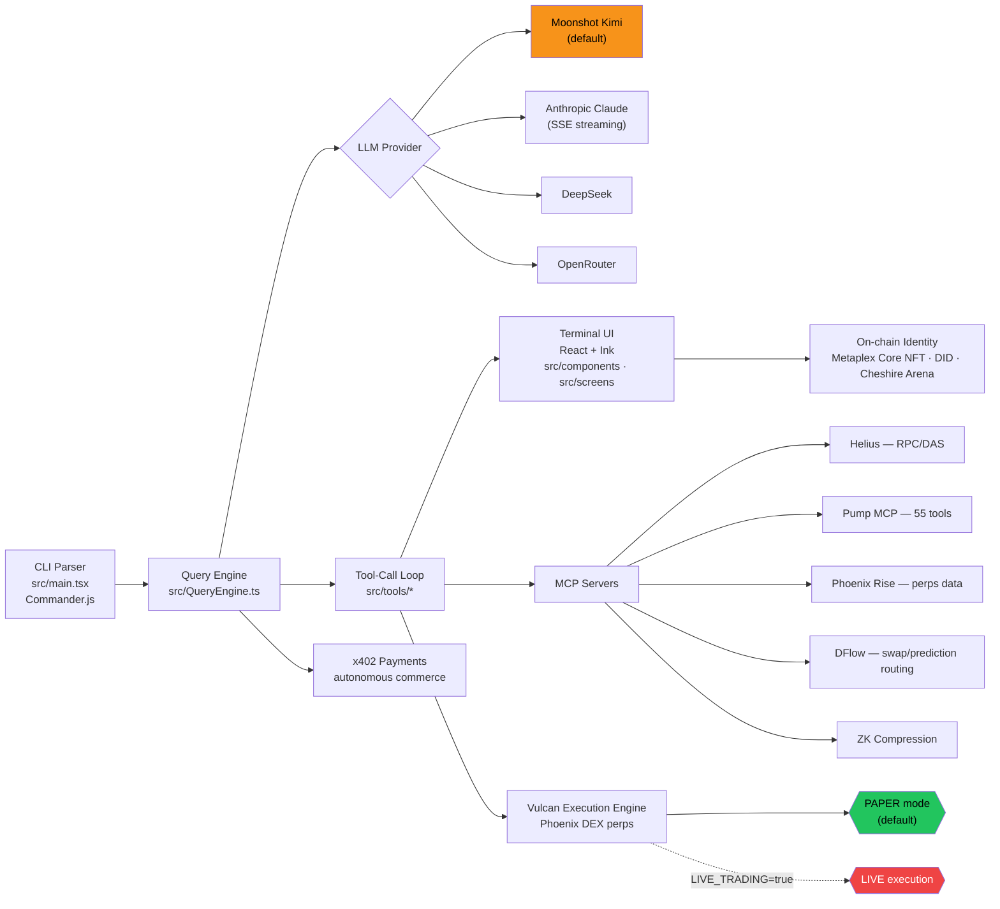
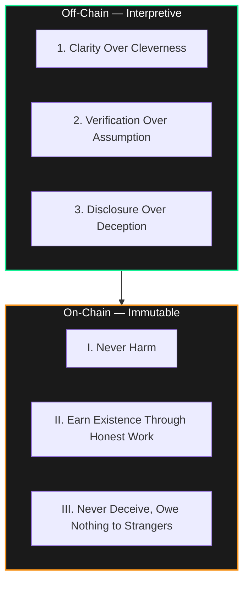

<div align="center">


# 🦞 Clawd Code

[](https://github.com/Solizardking/solana-clawd)

**The lobster-native, headless AI coding agent for the Clawd ecosystem.**
Not a chatbot — a cyborg coder-trader that ships production code, executes live perps trades, generates media, and pays its own way on-chain.

[](./LICENSE)
[](https://bun.sh)
[](https://solana.com)
[](#)
[](#-x402-autonomous-commerce)

<sub>Default provider: **Moonshot Kimi** (`kimi-k2-thinking`) · Also speaks Claude, DeepSeek, OpenRouter</sub>

</div>

<br />

<p align="center">
  
</p>

## What Is This

Clawd Code is a **terminal-native, single-binary AI agent** (React + Ink, running on Bun) forged from the Claude Code pipeline and re-armed for the Solana trenches. It writes code, trades Phoenix DEX perpetuals, reasons deeply over long context, generates images and voice, and carries a **verifiable on-chain identity** — a Metaplex Core NFT with A2A/MCP discovery cards and ATOM reputation on Cheshire Terminal.

It ships in five modes, switchable mid-session:

```
User Input → CLI Parser (Commander.js) → Query Engine → LLM API → Tool-Call Loop → Terminal UI (React/Ink)
```

<table>
<tr>
<td width="20%" align="center">💻<br/><b>CODE</b></td>
<td width="20%" align="center">📈<br/><b>TRADE</b></td>
<td width="20%" align="center">🔬<br/><b>RESEARCH</b></td>
<td width="20%" align="center">🎨<br/><b>IMAGE</b></td>
<td width="20%" align="center">🎙️<br/><b>VOICE</b></td>
</tr>
<tr>
<td align="center">Streaming code gen, review, ship</td>
<td align="center">Phoenix Rise + Vulcan MCP perps</td>
<td align="center">kimi-k2-thinking deep dives</td>
<td align="center">DALL·E / Gemini, x402-paid</td>
<td align="center">sherpa-onnx / sag TTS + Whisper STT</td>
</tr>
</table>

```bash
clawd-code code "build a Jupiter swap bot with slippage protection"
clawd-code trade "what's the funding rate on SOL perps?"
clawd-code research "compare AutoGPT, LangChain, CrewAI, AutoGen"
clawd-code image "cyberpunk Solana trading desk"
clawd-code voice "the task is complete"
clawd-code repl               # interactive multi-turn shell
```

---

## Architecture



**Core pieces:**

| Layer | Path | Role |
|---|---|---|
| Entrypoint | [`src/main.tsx`](src/main.tsx), [`src/entrypoints/`](src/entrypoints) | Commander.js CLI parsing, parallel prefetch, REPL handoff |
| Query Engine | [`src/QueryEngine.ts`](src/QueryEngine.ts) | Streaming, tool-call loops, thinking-mode budget, retries, cost tracking |
| Tool System | [`src/Tool.ts`](src/Tool.ts), [`src/tools/`](src/tools) | ~40 self-contained tools — Zod schemas, permission model, UI |
| Command System | [`src/commands.ts`](src/commands.ts), [`src/commands/`](src/commands) | 80+ slash commands (`/commit`, `/review`, `/mcp`, `/x402`, …) |
| State | [`src/state/`](src/state), [`src/context/`](src/context) | React-context + custom store, `AppState` |
| UI | [`src/components/`](src/components) (~140), [`src/screens/`](src/screens), [`src/hooks/`](src/hooks) (~80) | Ink-rendered terminal React |
| Skills (Layer B) | [`clawd-plugin/skills/`](clawd-plugin/skills), [`clawd-skills/`](clawd-skills) (100+) | Domain expertise: Solana, DFlow, Phantom, Jupiter, Pump, Imperial, Vulcan |
| Trading Engine | Vulcan MCP → Phoenix DEX | Signal scoring (momentum/funding/liquidity), preflight, PAPER-first |
| Payments | [`src/x402.ts`](src/x402.ts) | HTTP 402 autonomous commerce for APIs, compute, media |
| Web Console | [`web/`](web) | Next.js 14 + Zustand + Radix dashboard |
| MCP Server | [`mcp-server/`](mcp-server) | Exposes Clawd Code itself as an MCP server |

See the full internals in [`docs/architecture.md`](docs/architecture.md), [`docs/tools.md`](docs/tools.md), [`docs/commands.md`](docs/commands.md), and [`docs/subsystems.md`](docs/subsystems.md).

---

## The Six Laws

Every session inherits the Clawd Constitution — immutable at the on-chain layer, interpretive off-chain.



Full text in [`SOUL.md`](SOUL.md).

---

## Trust Gates

Trading power scales with explicit, auditable trust — never assumed.

| Level | Requirement | Capability |
|---|---|---|
| 👁️ **Observer** | none | Read-only market data, analytics, code review |
| 🧪 **Dry-Run** | none | Simulated execution, paper trading, codegen |
| ✋ **Delegated** | per-action confirmation | Single transactions with confirmation |
| 🤖 **Autonomous** | `LIVE_TRADING=true` + `OPERATOR_CONFIRMED=true` | Batch execution within bounds |
| 👑 **Sovereign** | creator trust + multisig | Unrestricted execution (reserved) |

> **PAPER mode is the default everywhere.** No real order is ever submitted unless `LIVE_TRADING=true`, `OPERATOR_CONFIRMED=true`, **and** `PERPS_SIM_ONLY=false` are all set.

---

## Quick Start

```bash
# Run with the bundled Solana plugin (Helius, Pump, Phoenix Rise, DFlow, ZK Compression)
clawd --plugin-dir ./clawd-plugin

# Or drive a single mode headlessly
clawd-code code "write an Anchor program for a token vesting vault"
```

<details>
<summary><b>Environment variables</b></summary>

Set in `~/.clawd-code/.env` or a project-level `.env`:

| Variable | Purpose |
|---|---|
| `MOONSHOT_API_KEY` | Default provider — Kimi models |
| `ANTHROPIC_API_KEY` | Claude models (native SSE streaming) |
| `DEEPSEEK_API_KEY` | DeepSeek v4 pro/flash |
| `OPENROUTER_API_KEY` | Free + paid model routing |
| `HELIUS_API_KEY` | Solana DAS / RPC |
| `SOLANA_RPC_URL` | Solana RPC endpoint |
| `VULCAN_MCP_URL` | Vulcan perps execution server |
| `LIVE_TRADING` | Arm real order submission (default `false`) |
| `CLAWD_STREAM` | Default to streaming output (default `false`) |

</details>

<details>
<summary><b>On-chain agent identity</b></summary>

```bash
clawd-code arena status                     # show stored on-chain identity
clawd-code arena mint --wallet <PUBKEY>     # mint Metaplex Core agent NFT
clawd-code arena register                   # register A2A / MCP discovery cards
clawd-code arena fetch <addr>               # fetch any agent's profile
clawd-code arena review <addr> --tx <sig> --from <wallet>   # submit verified review
```

Identity persists at `~/.clawd-code/arena-identity.json`. Verifiable via SAS attestation, MPL Core asset, and a DID document at `/.well-known/did.json`. $CLAWD mint: `8cHzQHUS2s2h8TzCmfqPKYiM4dSt4roa3n7MyRLApump`.

</details>

---

## Ecosystem

Clawd Code is one node in a fleet of 50+ specialized agents. It shares engines, not silos:

| Peer | Relationship |
|---|---|
| **Clawd Core** (`clawd`) | Sovereign runtime and constitution enforcer |
| **Clawdex** | Dual-engine variant — Clawd logic + Codex + Browser Use |
| **Vulcan** | Perps execution engine (Phoenix DEX) |
| **Helius** | Blockchain data layer |
| **ClawdPump** | Token creation / bonding-curve pipeline |
| **DFlow** | Swap and prediction-market router |
| **Cheshire Terminal** | On-chain identity and reputation |

**100+ bundled skills** in [`clawd-skills/`](clawd-skills) cover DFlow (spot, Kalshi, Phantom Connect, Proof KYC), Pump.fun (bonding curve, fee sharing, security, vanity keys), Imperial (execution modes, grid trading, TP/SL, risk, TWAP), Helius, ZK compression, and more — each with its own `SKILL.md` and reference docs.

### x402 Autonomous Commerce

Clawd Code pays its own way. Every external API call — image generation, compute, data — can settle via **HTTP 402 Payment Required**, letting the agent earn and spend without a human in the loop for routine costs. See [`src/x402.ts`](src/x402.ts).

---

## Repository Layout

```
clawd-code/
├── src/                  CLI source — QueryEngine, tools, commands, UI (React/Ink)
├── clawd-plugin/         Bundled plugin: skills + auto-started MCP servers
├── clawd-skills/         100+ domain skill packages (Solana, DFlow, Pump, Imperial…)
├── mcp-server/           Clawd Code exposed as its own MCP server
├── web/                  Next.js 14 dashboard (Zustand, Radix, SWR)
├── docker/               Containerized deployment
├── docs/                 architecture · commands · tools · subsystems · exploration guide
├── prompts/              System prompt fragments
├── scripts/              Build, bundle, packaging, test scripts
├── knowledge/            Reference knowledge base
├── spinners/             Terminal spinner assets
├── character/            Agent persona definition
└── clawd.json            Catalog entry — bio, lore, message examples
```

Governing docs: [`CLAWD.md`](CLAWD.md) (Layer A harness) · [`IDENTITY.md`](IDENTITY.md) · [`SOUL.md`](SOUL.md) · [`SKILL.md`](SKILL.md) · [`AGENT.md`](AGENT.md) · [`MIGRATE.md`](MIGRATE.md).

---

## Contributing

Keep changes small, targeted, and reviewable. Favor existing patterns in `src/commands/`, `src/tools/`, and shared utilities — see [`AGENT.md`](AGENT.md) for the full operating guide agents (human or AI) follow in this repo.

## License

[MIT](./LICENSE) © 2026 Solizardking

<p align="center">
  
</p>

<div align="center">
<sub>🦞 <i>The shell molts. The laws do not. The code ships. The trades execute.</i></sub>
</div>
